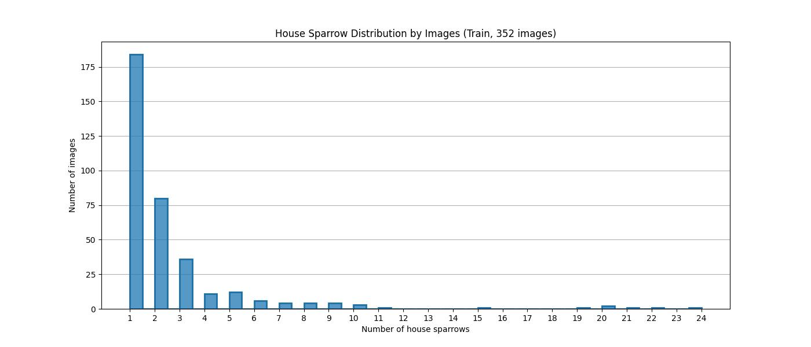
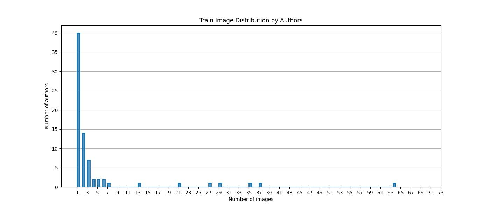
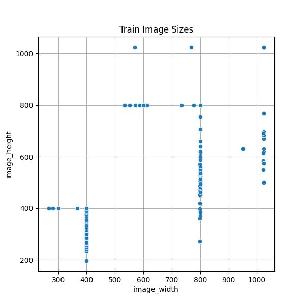
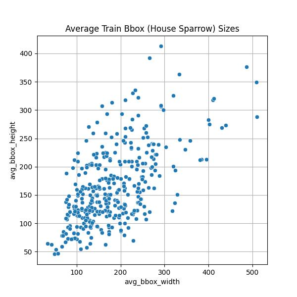

# Dataset Card[^*]
## Dataset Description
### ***Dataset Summary***
The dataset was created for tasks of detecting and counting house sparrows in photos using a neural network model. It consists of a photo set (`.jpg`) of house sparrows and two `.csv` files containing annotation results and general information about each photo. The number of the sparrows and their sizes, as well as the sizes of the photos themselves, are various.
### ***Dataset Structure (Instances & Fields)***
* `images` - a directory containing collected photos of house sparrows.
* `image_info.csv` - a file with general information about each photo in the dataset (one row per image):

    - `Name`: image (photo) name with an extension
    - `Author`: author of the photo
    - `Number_HSparrows`: number of house sparrows in the image
    - `Source`: where was the photo taken from
    - `License`: type of license under which the photo is placed in the source by its author.

* `bboxes/bounding_boxes.csv` - a file containing annotation results in the **COCO** format (**xywh**) (one row per bounding box):

    - `label_name`: class name that a bounding box belongs to
    - `bbox_x`: coordinate of the starting point of the box along the x-axis
    - `bbox_y`: coordinate of the starting point of the box along the y-axis
    - `bbox_width`: bounding box width in pixels
    - `bbox_height`: bounding box height in pixels
    - `image_name`: photo name with an extension which the box was drawn on
    - `image_width`: image width in pixels
    - `image_height`: image height in pixels.

## Dataset Creation
### ***Data Collection***
The photos of house sparrows (Passer domesticus) were collected manually from [**Flickr**](https://flickr.com) based on their license type. The search for the necessary photos was carried out by the keyword "house sparrow". When choosing, preference was given to the images that differed in size, number and size of the sparrows, and the scene in them. The goal was to create as varied a set as possible. At the same time, the name of the photos, their authors, source, types of license, and the number of the house sparrows in them were entered into the `image_info.csv` file (also manually).
### ***Image Annotation***
The bounding boxes were drawn around each house sparrow manually using [**Make Sense**](https://github.com/SkalskiP/make-sense), and a class label was indicated. The sparrows did not have to be completely visible; the main thing is that it was possible to identify the type of bird by this visible part. At the end of the annotation, results were saved in the **COCO** format to the `bounding_boxes.csv` file with the name and size of the corresponding image automatically added for each box.
## Data Splitting
### ***Training and Test Dataset Structure (Instances & Fields)***
* `train.csv` - a file containing information about images for training (one row per image):

    - `Name`: image (photo) name with an extension (taken from `image_info.csv`)
    - `Author`: author of the photo (taken from `image_info.csv`)
    - `Number_HSparrows`: number of house sparrows in the image (taken from `image_info.csv`)
    - `Source`: photo source (taken from `image_info.csv`)
    - `License`: type of photo license (taken from `image_info.csv`)
    - `avg_bbox_width`: average width of the bounding boxes in the image (calculated on data from `bounding_boxes.csv`)
    - `avg_bbox_height`: average height of the bounding boxes in the image (calculated on data from `bounding_boxes.csv`)
    - `image_width`: image width in pixels (taken from `bounding_boxes.csv`)
    - `image_height`: image height in pixels (taken from `bounding_boxes.csv`).

* `test.csv` - a file containing information about images to test. All the fields in it are similar to the fields in the `train.csv` file.
### ***EDA of Training Data***

### ***Data Split Implementation***
Data splitting into training and test sets is carried out stratified by pseudo-classes, as well as taking into account the belonging of the images to a certain group. The `Number_HSparrows` field of the `image_info.csv` file acts as a pseudo-class, and the `Author` as a group. The process is performed automatically using a specially created function. As a result, the output datasets receive the images with approximately the same number of house sparrows, and the sets do not overlap by author. For training purposes, the largest set is always chosen.

Then, information about the average sizes of the bounding boxes and the image sizes is added to the output datasets, and the results are saved to `train.csv` and `test.csv` files. The set of the images itself is not divided directly; if necessary, selection is made from it by their names.

Immediately before training the neural network model, the training dataset is again split in the same way into training and validation sets, but no additional information is entered and the results are not saved to files.
## Additional Information
### ***General Information***
Sample files and images of the dataset are located in the `tests/data_samples` directory.

*The complete dataset is uploaded to [**Kaggle**](https://www.kaggle.com/datasets/data42lana/house-sparrow-detection) so that the entire ML pipeline in this project can be reproduced, including with new data.*

To find a specific photo from the dataset in the source ([**Flickr**](https://flickr.com)), we need to go to its author's page and add "/" with the first part of the photo name (numbers before the "_" sign) to a URL. *For example, we want to find the `52089256535_d3b996ae78_w.jpg` photo by `Wildlife Terry`. By going to the author's page, we get the URL: `https://www.flickr.com/photos/wistaston.` By adding `/52089256535` to it, the link to the photo will look like this: `https://www.flickr.com/photos/wistaston/52089256535` (sometimes the author's name and his nickname may be the same).*
### ***Technical Information***
The data are stored on the local file system and versioned by [**DVC**](https://github.com/iterative/dvc). Paths to the specific data files and the image set are specified in the `configs/params.yaml` file (`image_data_paths`), as well as where and how to store new data (`new_image_data_paths`).

The dataset is checked before use in several steps using [**Great Expectations**](https://github.com/great-expectations/great_expectations) (`great_expectations` directory), [**Deepchecks**](https://github.com/deepchecks/deepchecks) tools (`data_checks/check_bbox_duplicates_and_two_dataset_similarity.py`), and additional functions (`data_checks/check_img_info_and_bbox_csv_file_integrity.py`).

The `train.csv` and `test.csv` files are created when the `src/data/prepare_data.py` module is run, and the splitting is done using the `src\utils.py: stratified_group_train_test_split` function in it.
### ***License Information***
Each photo in the dataset has a specific type of license, which can be found in the `License` field of the `image_info.csv` or  the `train.csv` and `test.csv` files. The license information must be verified before using any photo from the dataset on its page on [**Flickr**](https://flickr.com) and its use must abide by [the terms of use specified in the current license](https://www.flickr.com/creativecommons/).

[^*]: *Based on [Hugging Face Hub Dataset Card Template](https://github.com/huggingface/huggingface_hub/blob/main/src/huggingface_hub/templates/datasetcard_template.md).*
