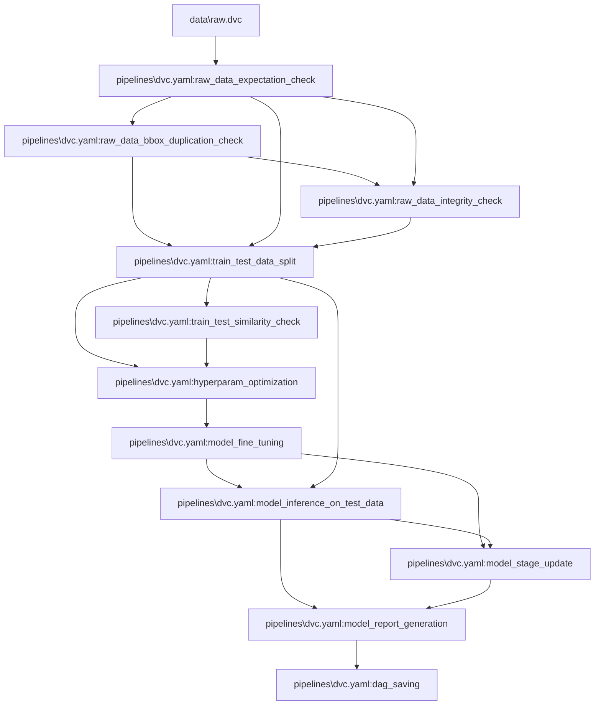

```mermaid
flowchart TD
	node1["data\raw.dvc"]
	node2["pipelines\dvc.yaml:dag_saving"]
	node3["pipelines\dvc.yaml:hyperparam_optimization"]
	node4["pipelines\dvc.yaml:model_fine_tuning"]
	node5["pipelines\dvc.yaml:model_inference_on_test_data"]
	node6["pipelines\dvc.yaml:model_report_generation"]
	node7["pipelines\dvc.yaml:model_stage_update"]
	node8["pipelines\dvc.yaml:raw_data_bbox_duplication_check"]
	node9["pipelines\dvc.yaml:raw_data_expectation_check"]
	node10["pipelines\dvc.yaml:raw_data_integrity_check"]
	node11["pipelines\dvc.yaml:train_test_data_split"]
	node12["pipelines\dvc.yaml:train_test_similarity_check"]
	node1-->node9
	node3-->node4
	node4-->node5
	node4-->node7
	node5-->node6
	node5-->node7
	node6-->node2
	node7-->node6
	node8-->node10
	node8-->node11
	node9-->node8
	node9-->node10
	node9-->node11
	node10-->node11
	node11-->node3
	node11-->node5
	node11-->node12
	node12-->node3
```
